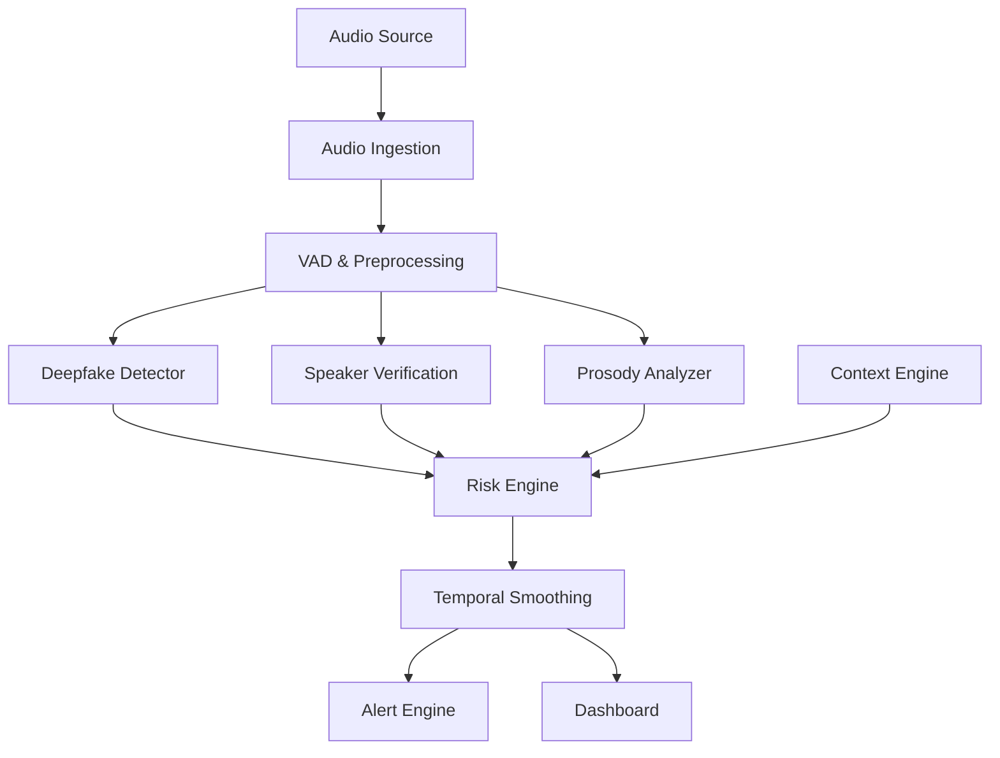

# VOICEGUARD

**AI-powered realtime voice-cloning impersonation detection and fraud-prevention platform.**

VOICEGUARD is a defensive cybersecurity prototype that analyzes live or uploaded speech to
estimate the likelihood it is synthetic/cloned, verifies speaker identity against a reference
voice, extracts prosodic anomalies, and combines all of this with contextual fraud indicators
(transaction value, urgency, bypass requests, etc.) into a single, explainable **risk score**.

> **This is a defensive security and fraud-prevention tool**, designed for authorized testing,
> synthetic/demo identities, and legitimate security monitoring — not for generating or evading
> detection of synthetic speech. It does **not** claim to detect synthetic speech with perfect
> certainty; every output is a probability, confidence, or risk indicator (see
> [`docs/ml_pipeline.md`](docs/ml_pipeline.md)).

## Features

- Upload-based and near-real-time WebSocket audio analysis
- Synthetic/cloned-speech detection (classical baseline, pluggable pretrained encoders)
- Speaker verification via configurable-threshold embedding similarity
- Prosodic/acoustic anomaly scoring (pitch, jitter, shimmer, pause patterns, etc.)
- Configurable contextual risk engine (transaction value, urgency, bypass requests, ...)
- Temporal smoothing (EMA / moving average) for stable streaming risk scores
- Alerting with configurable severity thresholds and recommended actions
- React/TypeScript SOC-style dashboard: live monitoring, call details, speaker registry,
  alerts, analytics, and a fully local demo mode
- Privacy-by-design: raw audio is **not** persisted by default; only derived metadata/scores
- REST + WebSocket APIs for future telecom/IVR integration

## Architecture



See [`docs/architecture.md`](docs/architecture.md) for a deeper walkthrough.

## Repository Structure

```
voiceguard/
├── backend/        FastAPI service (API, WebSocket, services, ORM models)
├── ml/             Deepfake / speaker / prosody models, training & inference
├── frontend/        React + TypeScript + Vite SOC dashboard
├── datasets/        Where you place real/ and synthetic/ audio for training
├── scripts/         Setup, dataset validation, demo data generation
├── docs/            Architecture, API, ML pipeline, privacy, deployment docs
└── notebooks/        Baseline experimentation notebook
```

## Installation

### Prerequisites
- Python 3.11+
- Node.js 20+
- PostgreSQL 16 (or use Docker Compose)
- Redis 7 (or use Docker Compose)
- Docker + Docker Compose (recommended for the fastest start)

### Environment configuration

```bash
cp .env.example .env
# Edit .env: set API_SECRET to a real secret, adjust DATABASE_URL/REDIS_URL if not using Docker.
```

### Option A — Docker Compose (recommended)

```bash
docker compose up --build
```

This starts PostgreSQL, Redis, the FastAPI backend (port 8000), and the frontend (port 5173).

### Option B — Run locally

```bash
make install     # installs backend + frontend dependencies
make backend     # runs FastAPI with --reload on :8000
make frontend    # in a second terminal, runs Vite dev server on :5173
```

### Database setup

Tables are auto-created on backend startup for local development. For production, use Alembic
migrations instead (see [`docs/deployment.md`](docs/deployment.md)).

### ML setup

VOICEGUARD works out of the box in **baseline mode** — classical ML over log-mel/MFCC features,
no GPU or downloads required. To optionally enable pretrained encoders (wav2vec2/HuBERT/WavLM,
ECAPA-TDNN, etc.), see [`scripts/download_models.py`](scripts/download_models.py) and set
`USE_PRETRAINED_ENCODERS=true` in `.env`.

### Dataset setup

Place audio under `datasets/real/` and `datasets/synthetic/` (see
[`docs/ml_pipeline.md`](docs/ml_pipeline.md)), then:

```bash
python scripts/validate_dataset.py
python ml/deepfake/train.py
python ml/deepfake/evaluate.py
```

VOICEGUARD does not download any dataset automatically — obtain datasets such as ASVspoof
directly and respect their license terms.

### Running the demo

```bash
make docker-up        # or `make backend` + `make frontend` locally
make demo             # populates demo calls/risk-events/alerts via the REST API
```

Then open `http://localhost:5173` and visit **Demo Mode** in the sidebar to upload audio,
run detection, and review the three scripted scenarios (genuine caller, synthetic caller,
high-risk impersonation).

## API Documentation

Interactive OpenAPI docs are served at `http://localhost:8000/docs` once the backend is
running. See also [`docs/api.md`](docs/api.md) for a written summary of every endpoint.

## Testing

```bash
make test
```

Runs backend `pytest` (unit tests for audio preprocessing, risk scoring, temporal smoothing,
speaker verification, plus an integration test covering upload → detection → risk → alert, and
a WebSocket round-trip test) and the frontend test suite.

## Docker

See [`docker-compose.yml`](docker-compose.yml) and the `Dockerfile`s under `backend/` and
`frontend/`. GPU/ML dependencies (`torch`, `transformers`) are optional at build time — the
backend image falls back to a lighter dependency set if the full install fails, and the app
runs in baseline mode either way.

## Limitations

- **This sandbox has no network access and lacks `torch`, `librosa`, `soundfile`, and `fastapi`.**
  Every file passes `py_compile`. All logic that could run without those libraries — dataset
  loading, speaker-leakage-safe splitting (7 tests), classification metrics (8 tests), the
  CNN's torch-unavailable fallback behavior (4 tests), spectrogram padding/normalization
  (6 tests), and the "no dataset present" messaging — was **actually executed and passed**
  (19/19). Tests requiring `torch`/`librosa`/`soundfile` (CNN forward pass, checkpoint
  save/load, real audio preprocessing, and the full train→evaluate smoke test) are written
  and gated with `pytest.importorskip` so they run for real once you have the full
  dependency set — which is exactly what `docker compose up --build` / `make install` gives
  you. Run `make test` inside that environment to execute them.
- The synthetic-voice detector's primary baseline is now a small PyTorch CNN
  (`ml/deepfake/model.py:SyntheticVoiceCNN`, ~40k parameters) trained on fixed-size log-mel
  spectrograms — see [`docs/ml_pipeline.md`](docs/ml_pipeline.md). A classical
  logistic-regression detector remains as a defensive fallback if PyTorch itself is
  unavailable at runtime. **No accuracy numbers are claimed anywhere in this repo** — until
  you run `python -m ml.deepfake.train` against real data and `python -m ml.deepfake.evaluate`
  to see real metrics, the API reports `UNCERTAIN` / `-untrained` rather than a fabricated score.
- Speaker verification thresholds must be calibrated per deployment (see
  `ml/speaker/verification.calibrate_threshold`) — a given similarity score is not universally
  "same person."
- WebSocket streaming targets near-real-time performance on commodity hardware; true low-latency
  production streaming (e.g. sub-200ms end-to-end) requires further optimization and is not
  guaranteed by this prototype. Latency is measured and surfaced, not fabricated.

## Privacy Considerations

Raw audio is **not** stored by default (`RAW_AUDIO_RETENTION_SECONDS=0`). See
[`docs/privacy.md`](docs/privacy.md) for the full privacy design and — importantly — a note that
organizations deploying VOICEGUARD must perform their **own legal/compliance assessment**
(e.g. call-recording consent laws) for their jurisdiction; this project makes no compliance
claims.

## Security Considerations

See [`docs/deployment.md`](docs/deployment.md) for CORS, secrets, rate-limiting, and
authentication guidance. No offensive-security functionality is included in this project.

## License

MIT — see [`LICENSE`](LICENSE).
